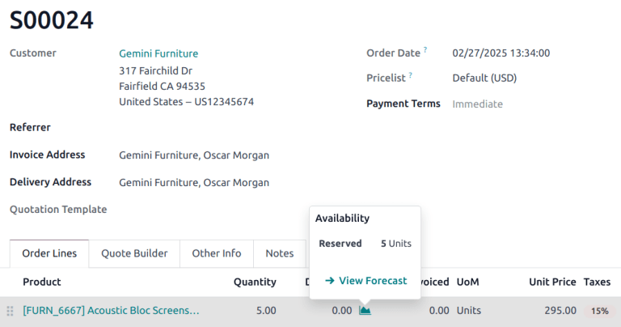
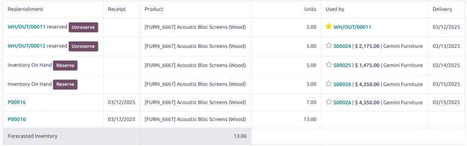

=================
Forecasted report
=================

.. |SO| replace:: :abbr:`SO (sales order)`
.. |SOs| replace:: :abbr:`SOs (sales orders)`
.. |RFQs| replace:: :abbr:`RFQs (Requests for Quotation)`
.. |POs| replace:: :abbr:`POs (purchase orders)`
.. |PO| replace:: :abbr:`PO (purchase order)`
.. |MO| replace:: :abbr:`MO (manufacturing order)`
.. |MOs| replace:: :abbr:`MOs (manufacturing orders)`

The **Inventory** *forecasted report* provides a real-time view of projected stock levels, helping
businesses manage their inventory efficiently. This report is beneficial for planning and decision
making, ensuring stock availability for upcoming sales, manufacturing, and replenishment activities.

.. important::
   The forecast report is **only** available on products where inventory is being tracked, commonly
   referred to as a *storable product*.

Navigating the forecast report
==============================

To access the report, click the :icon:`fa-area-chart` :guilabel:`Forecasted` smart button on a
product form. Alternatively, the report can be access from a sales order (SO), by clicking on the
:icon:`fa-area-chart` :guilabel:`(Graph)` icon next to the product, then selecting :guilabel:`View
Forecast`.

The forecasted report consists of a graph and a table. The graph visually represents stock movements
over time. The following information is displayed:

- :guilabel:`On Hand`: current stock physically available in the warehouse.
- :guilabel:`Incoming`: quantities expected from confirmed purchase orders or manufacturing orders.
- :guilabel:`Outgoing`: quantities reserved for sales orders or other outgoing operations.
- :guilabel:`Forecasted`: projected stock levels based on confirmed and planned operations.

.. image:: forecast/forecast-chart.png
   :alt: An example of the chart on a forecast report.

The table provides detailed metrics regarding operations, including:

- :guilabel:`Replenishment`: Shows reserved quantities, especially useful for multi-step operations.
- :guilabel:`Receipt`: The date of receipt for the items.
- :guilabel:`Units`: The number of units involved in each operation.
- :guilabel:`Used by`: The operation the stock is allocated for.
- :guilabel:`Delivery`: The scheduled or expected date of stock movement.
- :guilabel:`Forecasted Inventory`: The forecasted stock levels.
- :guilabel:`Forecasted with Pending`: The updated stock levels with the pending stock movements
  considered.

Reserve and unreserve products
------------------------------

Users can reserve or unreserve products directly from the forecasted report, ensuring stock
allocation aligns with operational needs.

.. seealso::
   :doc:`../../shipping_receiving/reservation_methods`

Multi-step reservation
======================

Reserved quantities for multi-step incoming and outgoing shipments are indicated on in the
:guilabel:`Replenishment` column on the table of the report.

:guilabel:`Stock in Transit` refers to products that have been received, but are in transit to their
input or quality control locations. :guilabel:`Free Stock in Transit` refers to products received in
the input location, but not yet in stock.

Operations affecting the forecast report
========================================

The forecast report is influenced by various operations, each impacting stock levels differently.
Scheduled delivery dates, planned manufacturing dates, and expected arrival dates all affect the
forecast of inventory.

Requests for Quotation (RFQs) do not immediately impact the forecast report, as the products are not
confirmed for replenishment. Purchase orders (POs), however, do affect the report as the products
are expected to arrive after the |PO| has been confirmed.

Confirmed |SOs| decrease the forecasted stock, adjusting the report based on the scheduled delivery
date. Confirmed manufacturing orders (MOs) affect the forecasted stock for both raw materials and
finished goods.
